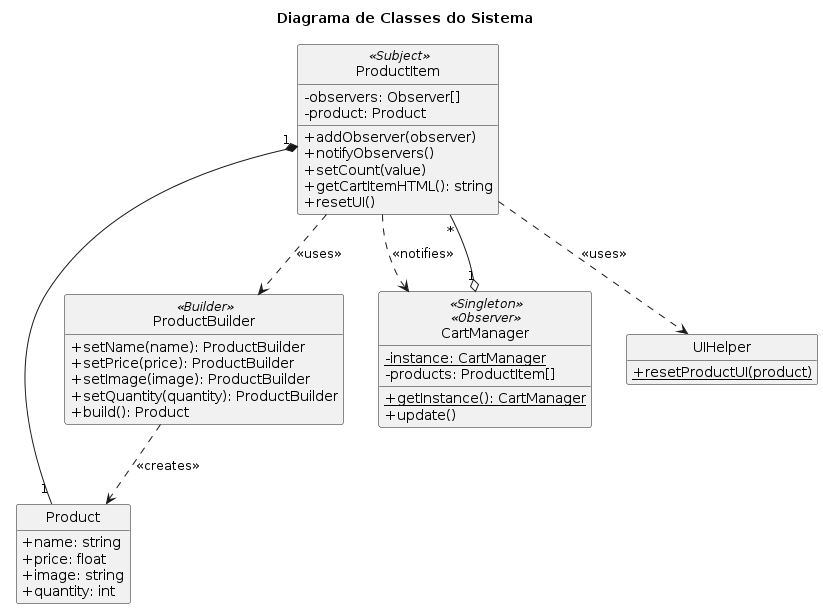

# Descrição do Projeto pelo Autor Original

# Shopping-Cart-
shopping cart built with pure HTML, CSS, and JavaScript. Add, remove, and update items with real-time calculations — no frameworks, just clean Vanilla JS.”
# Shopping Cart 🛒
## 📸 Preview


A simple, interactive Shopping Cart application built using **pure Vanilla JavaScript, HTML, and CSS**. No frameworks or libraries were used in this project.

---
  ## Author
Developed with ❤️ by KISHAN SHARMA
linkedin : https://www.linkedin.com/in/kishanshr/

## 🌟 Features
- 📦 **Add products to cart** with a smooth UI experience.
- ➕ **Increment** and ➖ **Decrement** item quantities.
- 🗑️ **Remove items** from the cart.
- 💰 **Dynamic total price calculation.**
- 📱 **Responsive design** for desktop, tablet, and mobile devices.
- 🎨 **Modern, clean, and elegant UI** using pure CSS.

---

## 📸 Preview


## 📸 Preview

## 📂 Project Structure
```
📁 Project Root
│
├── index.html      # Main HTML file
├── style.css       # Stylesheet for styling
├── script.js       # JavaScript for handling interactions
└── README.md       # This README file
```

---


---

## 🚀 Getting Started
1. Clone the repository:
```bash
 git clone <https://github.com/Kishan-shr/Shopping-Cart->
```
2. Open the project folder:
```bash
 cd <project-folder>
```
3. Open `index.html` in your browser to see the project in action.

---

## 📌 Usage
- Click the **Add to Cart** button to add an item to your cart.
- Modify quantities using the **Increment** (➕) and **Decrement** (➖) buttons.
- View the total price dynamically as you interact with the cart.
- Click the **Confirm Order** button to proceed with the order.

---

## 🔧 Tools & Technologies Used

| Technology      | Description                         |
|-----------------|-------------------------------------|
|        | Markup language for structuring content  |
|           | Styling and layout of the application    |
|   | Interactivity and dynamic behavior      |

---

## 📄 License
This project is open-source and available under the [MIT License](./LICENSE).

---

## 💡 Acknowledgments
- Designed and built with ❤️ using pure Vanilla JavaScript.


# Refatoração com Padrões de Software
Este repositório contém o projeto final da disciplina de **Padrões de Projeto de Software** da UFC, desenvolvido pela Equipe F. O objetivo central foi refatorar uma aplicação web de e-commerce simples, aplicando padrões de projeto para melhorar sua arquitetura, manutenabilidade e escalabilidade.

## 📝 Descrição do Projeto
A aplicação base oferece uma experiência de compra online, na qual o usuário pode gerenciar produtos em um carrinho, adicionando-os e removendo-os, e visualizar o total da compra em tempo real.

## 📐 Padrões de Projeto Implementados

### 1. Singleton
- **Descrição:** Garante que uma classe tenha apenas uma instância e fornece um ponto de acesso global a ela.
- **Aplicação no Projeto:** A classe `CartManager` foi implementada como um Singleton. Isso centraliza o controle do carrinho e garante que só exista uma instância dele, evitando inconsistências de dados.

### 2. Observer
- **Descrição:** Permite que um objeto (*Subject*) notifique automaticamente seus dependentes (*Observers*) sobre qualquer mudança de estado.
- **Aplicação no Projeto:** Quando a quantidade de um `ProductItem` (*Subject*) é alterada, ele notifica o `CartManager` (*Observer*). O `CartManager`, por sua vez, atualiza a lista de itens, o valor total e a interface do carrinho.

### 3.Builder
- **Descrição:** Separa a construção de um objeto complexo da sua representação, permitindo diferentes configurações.
- **Aplicação no Projeto:** Foi utilizado para a criação de objetos `Product`. O `ProductBuilder` facilita a montagem de produtos com múltiplos atributos (nome, preço, imagem, etc.) de forma clara e escalável.

## ✨ Principais Melhorias
- **Estrutura Orientada a Objetos:** O código foi modularizado em classes como Product, ProductItem e CartManager, separando responsabilidades.
- **Desacoplamento de Componentes:** O uso do padrão Observer permitiu que a lógica de negócio (o estado do carrinho) fosse desacoplada da sua representação visual (a interface).
- **Controle de Estado Centralizado:** O padrão Singleton garante que o carrinho de compras seja único em toda a aplicação, evitando inconsistências de dados.
- **Criação Flexível de Objetos:** O padrão Builder foi implementado para permitir que novos produtos sejam criados de forma flexível e escalável.

## 🏗️ Arquitetura do Sistema
Para estruturar a aplicação, foram criadas as seguintes classes, cada uma com sua responsabilidade:
- **`Product`**: Representa o modelo de dados de um produto, com atributos como nome, preço, imagem e quantidade.
- **`ProductBuilder`**: Implementa o padrão Builder para construir objetos `Product` de forma flexível e encadeada.
- **`ProductItem`**: Controla a lógica e a interface de um item de produto individual na vitrine. Atua como Subject no padrão Observer.
- **`CartManager`**: Gerencia o estado global e a lógica do carrinho de compras. Atua como Singleton e Observer.
- **`UIHelper`**: Classe estática com métodos auxiliares para manipular elementos da interface do usuário (UI), como resetar a aparência de um produto.

O diagrama UML abaixo ilustra como essas classes se relacionam:



## 🚀 Como Executar o Projeto
Como este é um projeto front-end com HTML, CSS e JavaScript puros, não há necessidade de instalação de dependências.

1.  **Clone o repositório:**
    ```bash
    git clone [https://github.com/DaviRisco/Entrega-Final-Padroes-de-Projeto-de-Software-UFC.git](https://github.com/DaviRisco/Entrega-Final-Padroes-de-Projeto-de-Software-UFC.git)
    ```

2.  **Navegue até a pasta do projeto:**
    ```bash
    cd Entrega-Final-Padroes-de-Projeto-de-Software-UFC
    ```

3.  **Abra o arquivo `index.html`** no seu navegador de preferência.

## 👥 Equipe
- Matheus Rodrigues Mota 
- Ana Clara Bezerra de Oliveira 
- Ianderson Carvalho Farias 
- Davi Angelo Farias 
